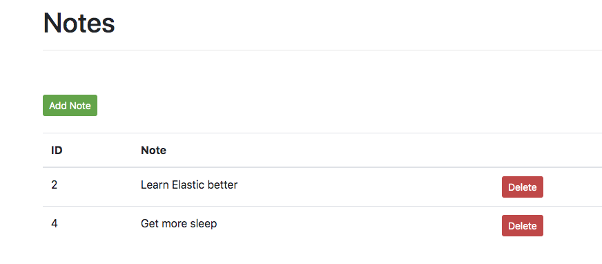
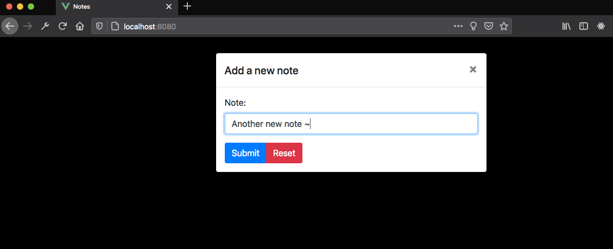

# What the hell is this

<a href="https://github.com/psf/black"></a>

This is just a tech assesment, that I decided to do in Flask; rather than Java for the api portion. I did the front end with VusJs

I like Python and Flask, why not. And wanted some VueJs hands on.

This isn't perfect, but I did the core api work rather quickly. Added on delete ability after the fact.

## How do I set this up?

I would first get a Python3 venv up and running. My venv here is on Python 3.8.4

`python3 -m venv venv`

Activate it for your session

`source venv/bin/activate`

Install dependancies that I used (Not much for this at all)

`pip install -r requirements.txt`

Once that's all set, run it!

```
$ flask run
 * Environment: production
   WARNING: This is a development server. Do not use it in a production deployment.
   Use a production WSGI server instead.
 * Debug mode: off
 * Running on http://127.0.0.1:5000/ (Press CTRL+C to quit)
127.0.0.1 - - [15/Jul/2020 19:26:13] "GET / HTTP/1.1" 200 -
```

## How do I use the notes app?

Well you can curl it, but the default route isn't fun

```
$ curl http://127.0.0.1:5000/
You're not looking for me...Use the api kid!
```

How about we check all of the notes we currently have

```
$ curl http://127.0.0.1:5000/api/v1.0/notes
{"notes":[{"body":"Buy car parts","id":1},{"id":2,"body":"Learn Elastic better"}]}
```

Hey now, that's better; but I only want note 2?

```
$ curl http://127.0.0.1:5000/api/v1.0/notes/2
{"note":{"id":2,"body":"Learn Elastic better"}}
```

But I wanna add my own note, Mike!  I've got you covered

```
$ curl -i -H "Content-Type: application/json" -X POST -d '{"body":"Listen to more DMB!"}' http://localhost:5000/api/v1.0/notes
HTTP/1.0 201 CREATED
Content-Type: application/json
Content-Length: 47
Server: Werkzeug/1.0.1 Python/3.7.7
Date: Thu, 16 Jul 2020 01:30:36 GMT

{"note":{"body":"Listen to more DMB!","id":3}}

$ curl http://127.0.0.1:5000/api/v1.0/notes/3
{"note":{"body":"Listen to more DMB!","id":3}}
```

How can I delete notes?

```
$ curl http://127.0.0.1:5000/api/v1.0/notes
{"notes":[{"body":"Learn Elastic better","id":2},{"body":"Get more sleep","id":4}]}

$ curl -XDELETE http://127.0.0.1:5000/api/v1.0/notes/4
{"message":"Note removed!","status":"OK"}

$ curl http://127.0.0.1:5000/api/v1.0/notes
{"notes":[{"body":"Learn Elastic better","id":2}]}
```

---

## But wait, there's a UI too!

So now that we have that API, we wanna do something with it!

So I decided to use Vue.js, as it's pretty fast to get up and running; as with Flask.

Make sure the Flask backend is running before you startup VueJs

Move into the `client/` directory, run a `npm install` and then `npm run serve`

You then should be up and running!  Try it!




## And Swagger!

`:5000/api/v1.0/swagger`


---

## Todo

- [X] Make the Vue componenets reference a system variable for the api stuff, to Dockerize.
- [ ] Need to get docker compse done
- [ ] Clean up the code a bit more.
